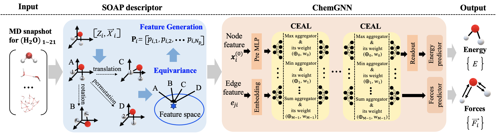

PDMD: Potential-Free Data-driven Molecular Dynamics
===

# Overview
This repository contains the code and data for the paper titled "PDMD: Potential-free Data-driven 
Molecular Dynamics for Variable-sized Water Clusters (H<sub>2</sub>O){n≤21}". The PDMD framework leverages 
ChemGNN, a graph neural network model, and SOAP (Smooth Overlap of Atomic Positions) descriptors to accurately 
and efficiently simulate the molecular dynamics (MD) of variable-sized water clusters with gas-to-liquid phase 
transition. This approach is capable of generalizing to other molecular systems, making it a versatile tool for 
data-driven molecular simulations.


# Contents

* [1 Structure of the Repository](#1-structure-of-the-repository)
* [2 Getting Started](#2-getting-started)
  * [2.1 Preparations](#21-preparations)
  * [2.2 Install Packages](#22-install-packages)
  * [2.3 Prepare Datasets](#23-prepare-datasets)
  * [2.4 Edit the Configuration File](#24-edit-the-configuration-file)
  * [2.5 Run Testing](#25-run-testing)
  * [2.6 Run Training](#26-run-training) 
* [3 Examples](#3-examples)
* [4 Citation](#4-citation)
* [5 Questions](#5-questions)

# 1. Structure of the Repository


```
PDMD
┌── PDMD/
├────── models/
├────── utils/
├────── test/
├── PDMD_DATASET/
├────── ENERGY_DATASET/
├────── FORCES_DATASET/
├── logs
├── saves
├── images
├── config.py
├── LICENSE
├── README.md
├── requirements.txt
└── run.py
```

- `PDMD/models/`: folder contains the model scripts
- `PDMD/utility/`: folder contains the utility scripts
- `PDMD/test/`: folder contains the test and MD scripts
- `PDMD_DATASET/ENERGY_DATASET/`: folder contains the processed data for the energy model
- `PDMD_DATASET/FORCES_DATASET/`: folder contains the processed data for the force model
- `logs/`: folder contains the files for logs
- `saves/`: folder contains saved models and training record figures
- `images/`: folder contains some important figures
- `config.py`: file of a configuration to be applied
- `LICENSE`: license file
- `README.md`: readme file
- `requirements.txt`: main dependent packages (please follow section 3.1 to install all dependent packages)
- `run.py`: training script


# 2. Getting Started

This project is developed using Python 3.9 and is compatible with macOS, Linux, and Windows operating systems.

## 2.1 Preparations

(1) Clone the repository to your workspace.

```shell
~ $ git clone https://github.com/TACC/PDMD
```

(2) Navigate into the repository.
```shell
~ $ cd PDMD
~/PDMD $
```

(3) Create a new virtual environment and activate it. In this case we use Virtualenv environment (Here we assume you have installed virtualenv using you source python script), you can use other virtual environments instead (like conda). This part shows how to set it on your macOS or Linux operating system.
```shell
~/PDMD $ python -m venv ./venv/
~/PDMD $ source venv/bin/activate
(venv) ~/PDMD $ 
```

You can use the command deactivate to exit the virtual environment at any time.

## 2.2 Install Packages

(1) Install main dependent packages.
```shell
(venv) ~/PDMD $ pip install -r requriements.txt
```

(2) Install homemade `dscribe` following the procedure below:
```shell
(venv) ~/PDMD $ wget https://taccchen.s3.us-east-2.amazonaws.com/PDMD_DATASET/dscribe.tar.gz
```
```shell
(venv) ~/PDMD $ tar xvfz dscribe.tar.gz
```
```shell
(venv) ~/PDMD $ cd dscribe
```
```shell
(venv) ~/PDMD/dscribe $ pip install .
```

(3) Install packages `torch-scatter`, `torch-sparse`, `torch-cluster` and `torch-geometric` manually corresponding to your operating systems and GPU version.

CPU Example:
```shell
(venv) ~/PDMD $ pip install torch-scatter==2.0.9 -f https://pytorch-geometric.com/whl/torch-2.0.0+cpu.html
(venv) ~/PDMD $ pip install torch-sparse==0.6.13 -f https://pytorch-geometric.com/whl/torch-2.0.0+cpu.html
(venv) ~/PDMD $ pip install torch-cluster==1.6.0 -f https://pytorch-geometric.com/whl/torch-2.0.0+cpu.html
```

CUDA Example (If you are not using CUDA 11.3, please modify the suffix part "cuXXX" of each following url to match your CUDA version):
```shell
(venv) ~/PDMD $ pip install torch-scatter==2.0.9 -f https://pytorch-geometric.com/whl/torch-2.0.0+cu113.html
(venv) ~/PDMD $ pip install torch-sparse==0.6.13 -f https://pytorch-geometric.com/whl/torch-2.0.0+cu113.html
(venv) ~/PDMD $ pip install torch-cluster==1.6.0 -f https://pytorch-geometric.com/whl/torch-2.0.0+cu113.html
```

## 2.3 Prepare Datasets
The energy and force dataset required for running model training can be downloaded via the link below:
```shell
(venv) ~/PDMD $ wget https://taccchen.s3.us-east-2.amazonaws.com/PDMD_DATASET/PDMD_DATASET.tar.gz
```
The download will take approximately several tens of minutes, and produce a compressed file of about 66GB. After extracting the file, you will obtain a folder named `PDMD_DATASET`. Please place this folder into the project directory to match the structure shown in **1. Structure of the Repository**.


The (H<sub>2</sub>O)<sub>{n≤21}</sub> `.pt` files can be found in the following location:

- **Energy Dataset**: Contains data required for energy predictions.
  - Path: `PDMD_DATASET/ENERGY_DATASET`

- **Force Dataset**: Contains data required for force predictions.
  - Path: `PDMD_DATASET/FORCES_DATASET`


## 2.4 Edit the Configuration File

(1) Edit your configuration file `config.py` (Please check the file name and place of your configuration file is correct). You can use command line tool `vim` or any other text editor.
```shell
(venv) ~/PDMD $ vi config.py
```

Given Example of the configuration file`config.py`:


```python
from PDMD import get_config

CONFIGS = {
    'data_config': {
        'main_path': './',
        'dataset': 'FORCES_DATASET',
        'model': 'ChemGNN_force',
    },
    'training_config': {
        'device_type': 'cpu',
        'loss_fn_id': 1,
        'epoch': 2000,
        'epoch_step': 1,
        'batch_size': 1024,
        'lr': 0.002,
        'seed': 0,
        'train_length': 0.8,
        'val_length': 0.2,
    }
}

config = get_config(CONFIGS)
```

At this step, you have the flexibility to make adjustments to the dataset and model type. You need to choose whether to train the energy model or the force model. 

- If `'dataset': 'ENERGY_DATASET'` and `'model': 'ChemGNN_energy'`, it indicates that the energy dataset is loaded and the energy model is trained.
- If `'dataset': 'FORCES_DATASET'` and `'model': 'ChemGNN_force'`, it indicates that the force dataset is loaded and the force model is trained.

## 2.5 Run Testing

(1) Run Testing. Note that we saved the trained energy and force models in test/energy.pt and test/forces.pt. Feel free to testing them.
```shell
(venv) ~/PDMD $ python run.py --benchmark
```

If you want to test your retrained model, please move the trained energy model to the `PDMD/test/` directory and rename it to `energy.pt`, and move the trained force model to the same directory and rename it to `forces.pt`, replacing the existing model files.

(2) Calculate MAE.
```shell
(venv) ~/PDMD $ python run.py --mae
```

## 2.6 Run Training

(1) Training Configurations
The table below show the training hyperparameters used in our experiments

| Model       | Epoch | Batch Size | Learning Rate |
|:-------------:|:-------:|:----------:|:-------------:|
| Energy      | 3000  | 2048       | 0.005         |
| Force       | 2000  | 1024       | 0.002         |


(2) Run Training. Note that if you have downloaded our data sets and saved them in the corresponding path, you do not need to process them anymore.

```shell
(venv) ~/PDMD $ python run.py --train
```

(3) Collect the auto-generated training results in `saves/`.
```shell
(venv) ~/PDMD $ ls saves/YYYYMMDD_HHMMSS_f/
loss_last_half.png      loss_last_quarter.png    loss_whole.png        model_last.pt           test_pred.npy
test_true.npy
```

# 3. Examples

The mean absolute errors (MAEs) of PDMD for (a) system energy, and (b) atomic force, across all (H<sub>2</sub>O)<sub>1&le;n&le;21</sub> clusters.

# 4. Citation
None

# 5. Questions

If you have any questions, please contact .


